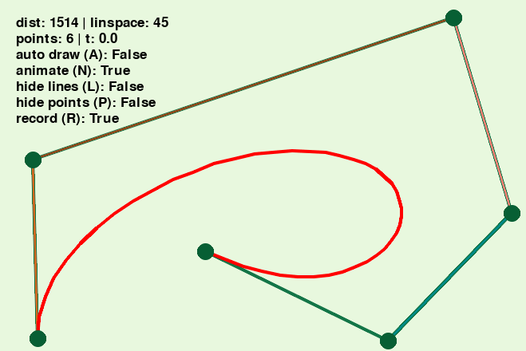

# Visual Bézier Curves

This app is a visual implementation of bézier curves using [Pygame](https://www.pygame.org/wiki/GettingStarted).

## Features

- adding and removing points using arrow keys
- moving points with mouse
- animating curve drawing
- recording animation to video
- hiding points and lines

## Dependencies

- python ones added to venv
- [ffmpeg](https://www.ffmpeg.org/) installed and added to PATH

